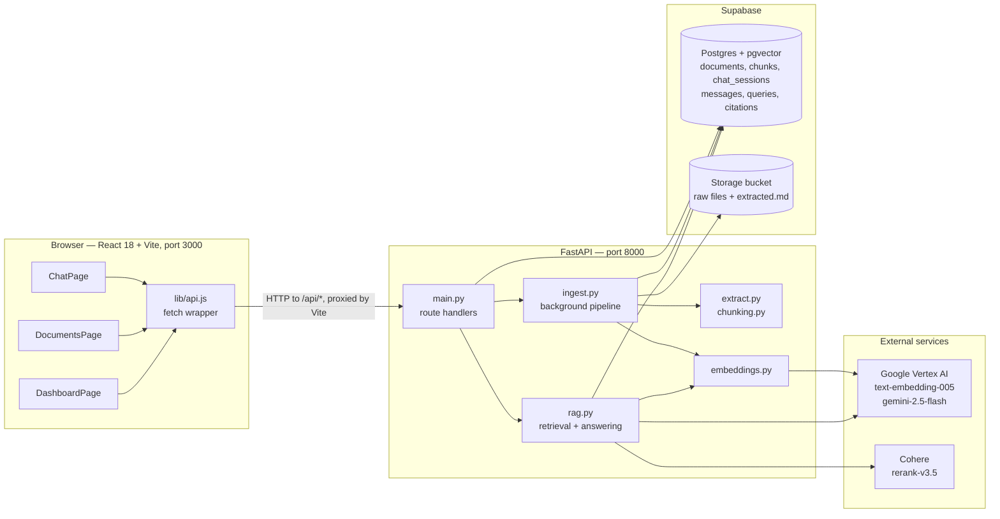
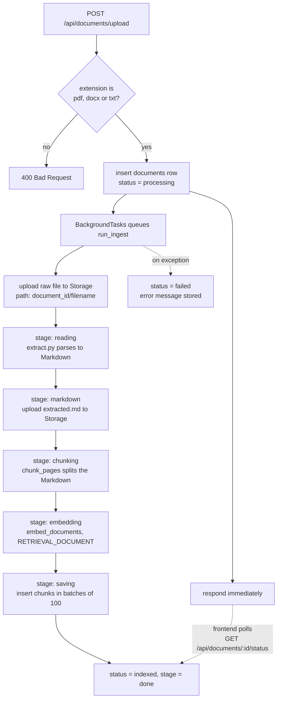
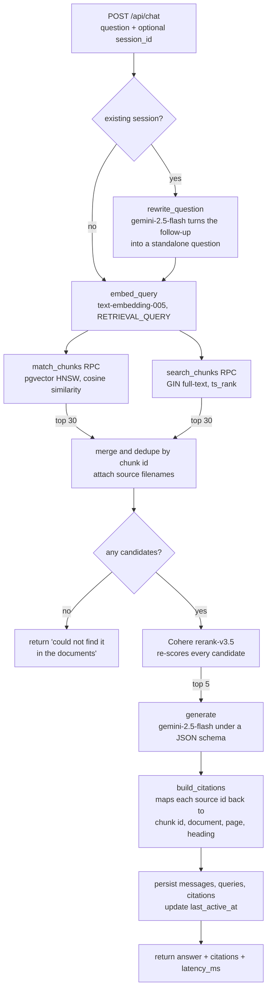
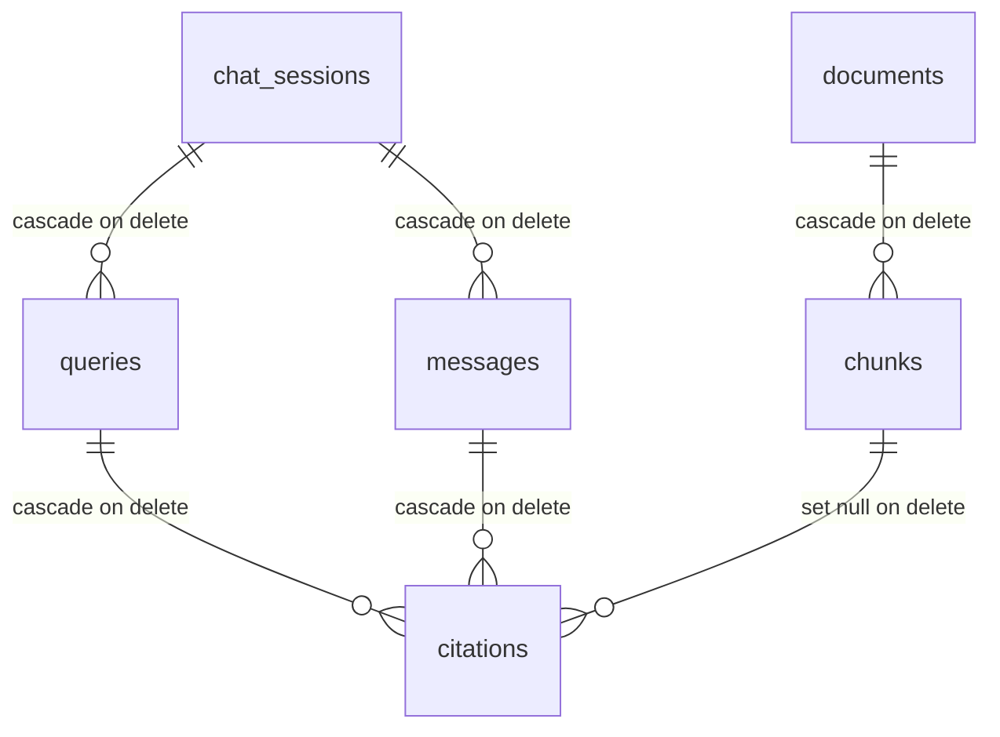

# Architecture

NexaCore Document Intelligence is a Retrieval-Augmented Generation system for company
policy documents. It has two pipelines that share the same storage layer: an **ingestion
pipeline** that turns uploaded files into searchable vectors, and a **query pipeline**
that answers questions using only those vectors.

---

## 1. System Overview



The frontend never talks to Supabase or the model providers directly. Every call goes to
`/api/*`, which the Vite dev server proxies to `http://localhost:8000`
(`frontend/vite.config.js`). API keys stay on the backend.

---

## 2. Ingestion Pipeline

Uploading returns immediately. The actual work runs in a FastAPI `BackgroundTasks`
job, and the frontend polls for progress.



### Extraction (`extract.py`)

| Format | Library | What it produces |
| :--- | :--- | :--- |
| PDF | `pymupdf` + `pymupdf4llm` | Per-page Markdown, plus author and page count |
| DOCX | `python-docx` | Heading styles become `#` levels, tables become Markdown tables |
| TXT | standard library | `---` / `===` underlines are promoted to `##` headings |

All three return the same shape — a list of `(page_number, text)` pairs — so everything
downstream is format-agnostic. Only PDFs carry real page numbers; DOCX and TXT return
`None`, which is why some citations show a page and some do not.

### Chunking (`chunking.py`)

Splitting happens in two passes:

1. **Split on Markdown headings** so a chunk never spans two unrelated sections. The
   current heading is carried forward and stored with each chunk.
2. **Split on sentence boundaries** using `pysbd`, accumulating sentences until the chunk
   reaches roughly 600 tokens, then carrying the last 2 sentences into the next chunk as
   overlap.

A trailing chunk under 40 tokens is merged back into the previous one, so retrieval never
returns a fragment too small to be useful.

### Indexing

Each chunk is stored with a 768-dimension embedding. The `fts` column is a **generated
column** — Postgres computes the `tsvector` on insert, so keyword search needs no extra
write from the application:

```sql
fts tsvector generated always as (to_tsvector('english', content)) stored
```

Two indexes back the two retrieval channels: an HNSW index with cosine distance for
vector search, and a GIN index for full-text search.

---

## 3. Query Pipeline



### Why hybrid retrieval

Dense vector search matches meaning but misses exact tokens — policy numbers, allowance
amounts, specific job titles. Keyword search catches those but misses paraphrases. Running
both and merging gives up to 60 candidates with the recall of both methods.

The two searches are issued sequentially, and the sparse leg is skipped entirely when the
question contains no term longer than two characters. Results are merged into a dict keyed
by chunk id, so a chunk found by both channels appears once.

### Why rerank

60 candidates is far more context than the model needs, and precision matters more than
recall once the answer is being written. Cohere `rerank-v3.5` scores every candidate
against the question directly — a cross-encoder, unlike the bi-encoder embeddings used for
retrieval — and only the top 5 reach the prompt.

### Grounded answering

The prompt numbers each source and requires the model to reply in a fixed JSON shape:

```json
{"answer": "...", "citations": [{"id": 0, "quote": "copied word for word"}]}
```

The schema is enforced by Vertex AI's `response_schema`, not just requested in the prompt.
`build_citations` then validates each returned id against the actual candidate list and
discards anything out of range, so a hallucinated source number cannot produce a citation.
The model is instructed to answer only from the sources and to say it could not find the
answer otherwise.

---

## 4. Data Model



| Table | Holds |
| :--- | :--- |
| `documents` | File metadata, ingestion `status` and `stage`, page and chunk counts |
| `chunks` | Chunk text, heading, page number, 768-d `embedding`, generated `fts` |
| `chat_sessions` | One row per conversation, ordered by `last_active_at` |
| `messages` | User and assistant turns, used to rebuild a conversation |
| `queries` | One row per question with `latency_ms`, powering the dashboard |
| `citations` | Verbatim quote plus a link back to the chunk it came from |

Deleting a document cascades to its chunks. Citations keep their stored quote and document
name even after the chunk is gone, because `chunk_id` is set to null rather than deleted —
so old answers stay readable in the dashboard.

---

## 5. Request Lifecycle Summary

| Endpoint | Path through the system |
| :--- | :--- |
| `POST /api/documents/upload` | Validate → insert row → queue background job → respond |
| `GET /api/documents/:id/status` | Read `documents` row, used for progress polling |
| `DELETE /api/documents/:id` | Remove Storage files, delete row, chunks cascade |
| `POST /api/chat` | History → rewrite → embed → hybrid search → rerank → generate → persist |
| `GET /api/chat/sessions` | 20 most recent sessions by `last_active_at` |
| `GET /api/dashboard/stats` | Aggregate counts and average latency over all queries |
| `GET /api/dashboard/responses` | Recent queries joined to their first citation |

---

## 6. Failure Handling

Rate limits are the main failure mode, since both embedding and generation call quota-limited
APIs.

- `embed_batch` retries up to 5 times on a 429, sleeping 20 seconds between attempts.
- `call_gemini` retries up to 3 times on a 429 with a backoff of 10, then 20 seconds.
- If generation still fails, `/api/chat` returns **503** with a readable message rather than
  a stack trace.
- Any exception during ingestion is caught by `run_ingest`, which marks the document
  `failed` and stores the error, so a bad file never leaves a row stuck on `processing`.

Embedding batches are capped at 100 texts or roughly 18,000 tokens, whichever comes first,
to stay inside the Vertex AI request limit.
