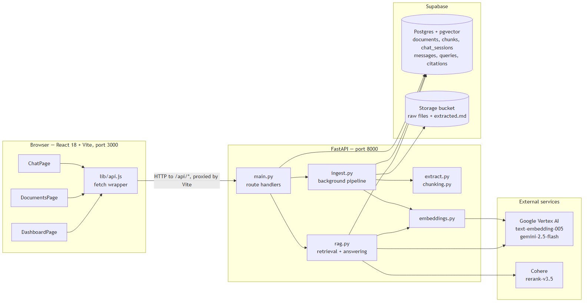

# 📚 Enterprise Document Intelligence & RAG Platform

A full-stack, enterprise-grade **Retrieval-Augmented Generation (RAG)** system and analytics dashboard for ingesting, indexing, and querying corporate policy documents (PDF, DOCX, TXT) with high precision, grounded AI responses, and exact verbatim citations.


---

## 🔗 Live Demo

| | Link |
| :--- | :--- |
| **Application** | https://docintel-omega.vercel.app |
| **API** | https://docintel-7vvc.onrender.com |
| **Interactive API Docs** | https://docintel-7vvc.onrender.com/docs |
| **Written API Reference** | [docs/api.md](docs/api.md) |

> **Note on first load:** the API runs on Render's free tier, which spins the server
> down after 15 minutes of inactivity. The first request after an idle period takes
> around 50–60 seconds while it wakes up. Every request after that is normal speed.

The frontend is deployed on **Vercel** as a static build, and the backend on **Render**
as an always-on container. Render was chosen over a serverless host because document
ingestion continues running in a FastAPI `BackgroundTask` after the upload response is
sent, and serverless functions are terminated as soon as the response returns.

---

## 🛠️ Tools & Technologies Used

| Component / Task | Tool / Technology Used |
| :--- | :--- |
| **PDF & DOCX Parser** | `PyMuPDF` (`pymupdf4llm`) & `python-docx` |
| **Chunking Strategy** | Heading-Aware Markdown Splitting + `pysbd` Sentence Segmenter |
| **Embedding** | Google Vertex AI (`text-embedding-005`) |
| **Vector Database** | Supabase PostgreSQL (`pgvector` Extension) |
| **Retrieval Strategy** | Hybrid Search (Dense Semantic Vector + Sparse Keyword FTS) |
| **Reranking** | Cohere Rerank v3.5 (`cohere.ClientV2`) |
| **Generation** | Google Gemini 2.5 Flash (`gemini-2.5-flash`) |

---

## 🏗️ Architecture

The system has two pipelines sharing one storage layer. **Ingestion** turns an uploaded file
into searchable vectors; **querying** answers a question using only those vectors.



| Diagram | What it shows |
| :--- | :--- |
| [System Overview](docs/diagrams/system-overview.png) | How the frontend, API, database and model providers connect |
| [Ingestion Pipeline](docs/diagrams/ingestion-pipeline.png) | Upload through extraction, chunking, embedding and indexing |
| [Query Pipeline](docs/diagrams/query-pipeline.png) | Question through hybrid retrieval, reranking and grounded answering |
| [Data Model](docs/diagrams/data-model.png) | Tables and their cascade-delete relationships |

---

## 🌟 Highlights & Capabilities

### 📄 1. Multi-Format Document Ingestion
- **PDF Extraction**: Parsed into per-page Markdown using `pymupdf` and `pymupdf4llm`.
- **DOCX Extraction**: Preserves paragraph heading hierarchies and converts tables directly into Markdown table syntax using `python-docx`.
- **TXT Extraction**: Automatically parses underline markers (`---`, `===`) into clean Markdown headers.

### ⚡ 2. Async Background Ingestion & Stage Tracking
- Uploading files offloads parsing, chunking, vector embedding, and storage to FastAPI `BackgroundTasks`.
- Tracks real-time ingestion stages: `reading` → `markdown` → `chunking` → `embedding` → `saving` → `done`.
- Supports full file management and cascade deletion (clears raw storage files, extracted markdown, document metadata, and chunk vectors).

### ✂️ 3. Heading-Aware & Sentence-Bounded Chunking
- Splits document text on Markdown section headings first to preserve semantic scope.
- Uses `pysbd` (Python Sentence Boundary Disambiguation) to segment text into ~600-token chunks with a 2-sentence overlap.
- Retains metadata per chunk: document ID, chunk index, page number, and section header.

### 🔀 4. Hybrid Search Engine (Dense + Sparse)
- **Dense Vector Search**: Generates 768-dimensional embeddings using Google Vertex AI `text-embedding-005` (`RETRIEVAL_DOCUMENT` for chunks, `RETRIEVAL_QUERY` for queries) and searches via PostgreSQL `pgvector` HNSW index with Cosine similarity (`match_chunks`).
- **Sparse Keyword Search**: Pre-calculates `tsvector` columns on ingestion and executes PostgreSQL GIN full-text search with English stemming and relevance ranking (`search_chunks`).
- Merges candidate results from both channels (top 30 dense + top 30 sparse).

### 🎯 5. Cohere Reranking
- Candidate chunks are re-scored using **Cohere Rerank v3.5** (`cohere.ClientV2`).
- Filters the 60 candidate chunks down to the top 5 most relevant passages before passing context to the LLM.

### 🤖 6. Contextual History Re-writing & Grounded QA
- **Follow-up Question Rewriting**: Uses Gemini 2.5 Flash to rephrase ambiguous follow-up questions into standalone queries based on past chat history.
- **Strict Grounded Generation**: Answers questions using **only** retrieved source chunks (never uses external knowledge).
- **Structured Citation Schema**: Enforces JSON response schema (`{"answer": "...", "citations": [...]}`) returning exact verbatim quotes, document titles, page numbers, and section headers.

### 📊 7. Interactive React UI & Analytics Dashboard
- **Chat Interface**: Multi-session navigation, suggestion prompts, interactive citation drawer, copy controls, and session deletion.
- **Document Management**: Document list, file size metrics, chunk counts, author metadata, live ingestion progress bar, drag-and-drop upload modal, and document deletion.
- **Analytics Dashboard**: Real-time stats cards (total docs/chunks/questions, average latency), query log table with latency timing, and AI response breakdown table showing cited sources.

---

## 📂 Repository File Structure

```
assignment_1/
├── backend/
│   ├── main.py              # FastAPI app routes (/api/documents, /api/chat, /api/dashboard)
│   ├── config.py            # Centralized settings & Pydantic environment validation
│   ├── database.py          # Supabase client singleton instance
│   ├── setup.sql            # SQL schema
│   ├── schemas.py           # Database-to-JSON API format transformers
│   ├── models.py            # Pydantic response models for the OpenAPI schema
│   ├── extract.py           # Document text extraction (PDF, DOCX, TXT)
│   ├── chunking.py          # Heading-aware sentence segmenter & chunker
│   ├── embeddings.py       # Google Vertex AI text embedding batches
│   ├── ingest.py            # Async document ingestion background task manager
│   ├── rag.py               # Question rewriter, Hybrid Search, Cohere Rerank, & Gemini QA
│   ├── pyproject.toml       # Python dependencies configuration
│   └── README.md            # Backend quick-start guide
│
├── frontend/
│   ├── src/
│   │   ├── App.jsx          # Main application router & persistent layout
│   │   ├── main.jsx         # React application entrypoint
│   │   ├── index.css        # Tailwind CSS directives & global styling
│   │   ├── lib/
│   │   │   └── api.js       # Centralized REST API fetch wrapper
│   │   ├── pages/
│   │   │   ├── ChatPage.jsx        # Conversational Q&A page
│   │   │   ├── DocumentsPage.jsx   # Document manager & upload page
│   │   │   └── DashboardPage.jsx   # Real-time analytics dashboard
│   │   └── components/
│   │       ├── chat/        # ChatHeader, ChatInput, Message
│   │       ├── dashboard/   # StatsCards, QueryTable, ResponseTable
│   │       ├── documents/   # DocumentTable, DeleteDialog
│   │       ├── layout/      # Sidebar
│   │       └── upload/      # UploadModal, ProcessingScreen
│   ├── package.json         # Node dependencies (React 18, Vite, Tailwind CSS)
│   ├── tailwind.config.js   # Custom dark theme configuration
│   └── vite.config.js       # Vite proxy & build configuration
│
├── docs/
│   ├── api.md               # Full REST API reference
│   └── diagrams/            # Rendered architecture diagrams (PNG)
├── ARCHITECTURE.md          # System design, pipelines & data model
└── README.md                # Top-level project documentation
```

---

## 🛠️ Environment Variables Configuration

Create a `.env` file in the `backend/` directory:

```env
# Supabase Configuration
SUPABASE_URL=https://your-project.supabase.co
SUPABASE_KEY=your-supabase-service-role-or-anon-key
SUPABASE_BUCKET=documents

# Google Cloud Platform (Vertex AI) Configuration
GCP_PROJECT=your-gcp-project-id
GCP_REGION=us-central1
GOOGLE_APPLICATION_CREDENTIALS=gcp-key.json

# Cohere API Configuration
COHERE_KEY=your-cohere-api-key
```

---

## 🚀 Setup & Installation Guide

### Prerequisites
- **uv**: Python package and project manager ([Install uv](https://docs.astral.sh/uv/getting-started/installation/))
- **Node.js**: 18.0 or higher
- **Supabase Account**: PostgreSQL database with `pgvector` enabled

---

### Step 1: Database Initialization
1. Log in to your **Supabase Dashboard** and open the **SQL Editor**.
2. Copy the contents of **[backend/setup.sql](file:///c:/Users/Bhavika/Downloads/assignment_1/backend/setup.sql)**.
3. Execute the query to initialize extensions, tables, indexes, and RPC functions.
4. Create a Storage Bucket named `documents` (or the name specified in your `.env`).

---

### Step 2: Backend Setup (using `uv`)

```bash
# 1. Navigate to the backend directory
cd backend

# 2. Sync dependencies and create virtual environment automatically
uv sync

# 3. Start the FastAPI development server
uv run uvicorn main:app --reload --port 8000
```

The REST API will be running at `http://localhost:8000`.

---

### Step 3: Frontend Setup

```bash
# 1. Open a new terminal and navigate to frontend directory
cd frontend

# 2. Install Node dependencies
npm install

# 3. Start the Vite development server
npm run dev
```

The application UI will open at `http://localhost:3000`.

---
